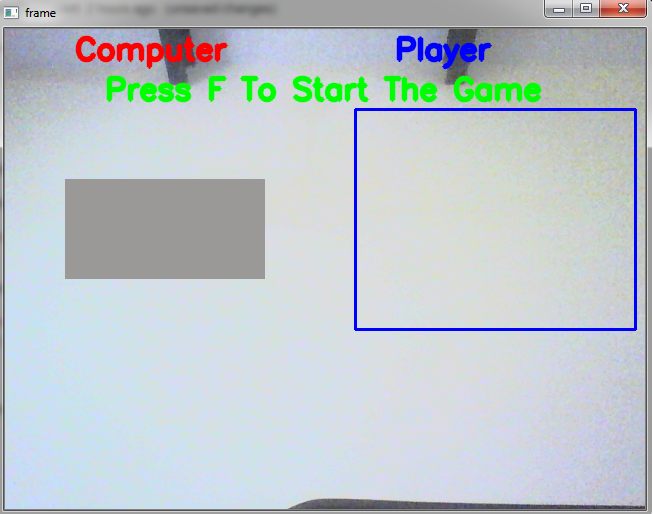

# rock_paper_scissor
<h3>It is a small Deep Learning project to play "rock paper scissor" game.</h3>

To play the game, user have to place his hand in blue box and have to make sign of any one i.e. rock, paper or scissor. Then computer will capture the image of user hand and predict whether it is a rock ,paper or scissor and will give the result accordingly

  

  

  

  

>
